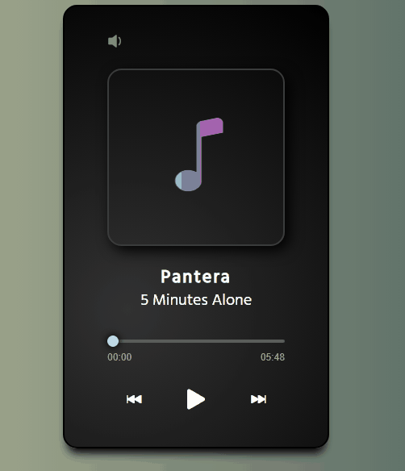

# 🎵 Music-Player 

Reprodutor de música simples, desenvolvido em javascript.

## ● Features ✅
- [x] Inicia a música
- [x] Pausa a música
- [x] Alterna para a próxima música
- [x] Alterna para a música anterior
- [x] Aumenta e Diminui o volume da música
- [x] Mostra a Duração e a Posição da reprodução atual da música

## ● ScreenShots 🖼️

● <a href='https://andersonbones.github.io/Music-Player/'>DEMO 👽</a>
